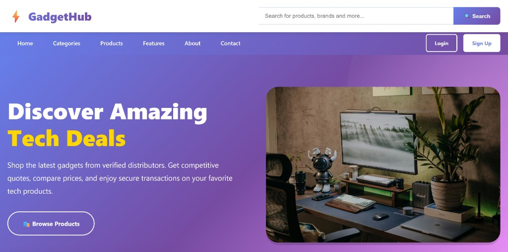
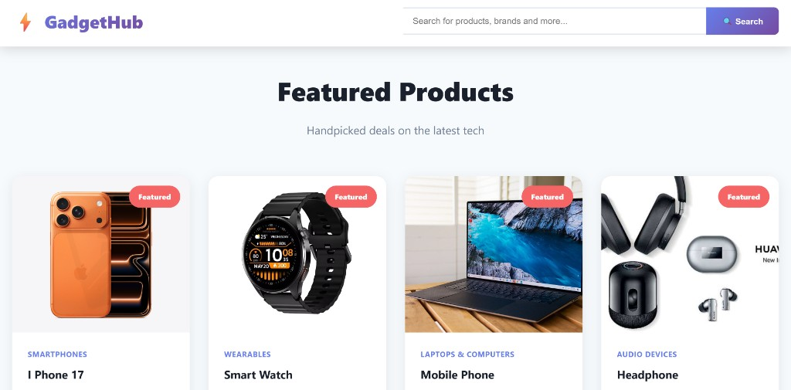
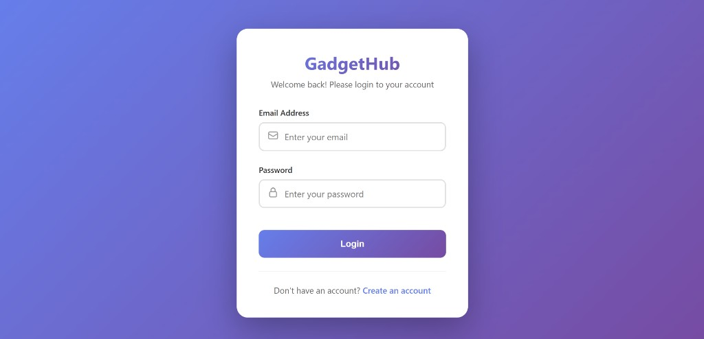
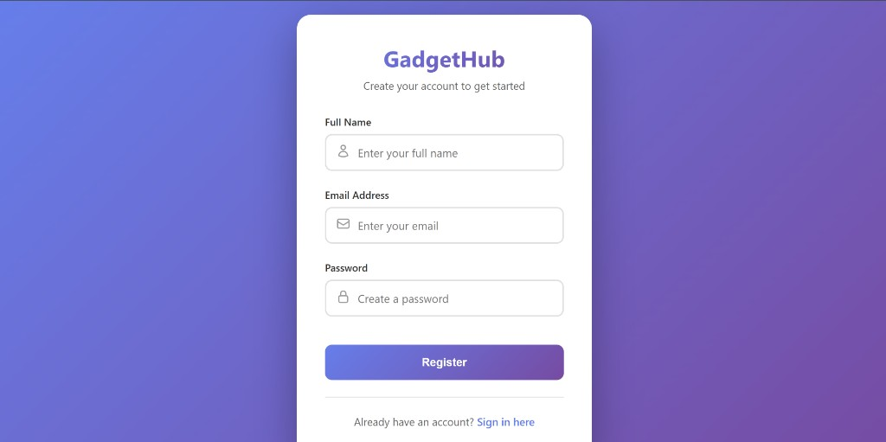
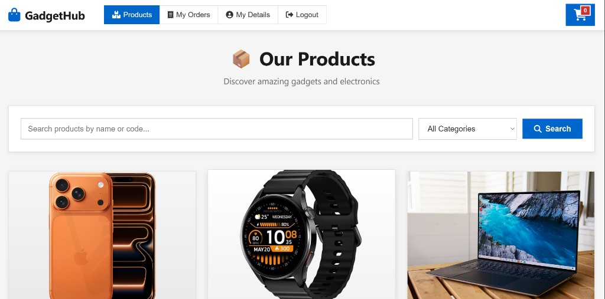
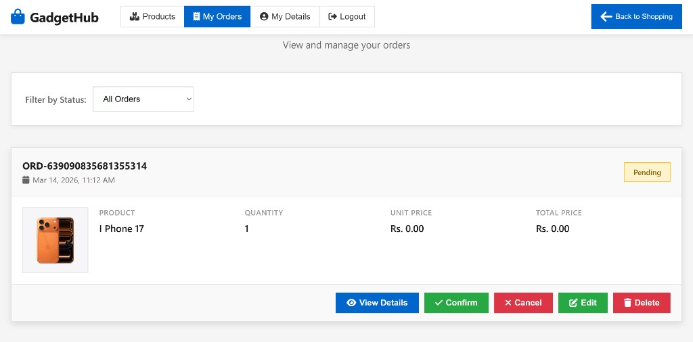
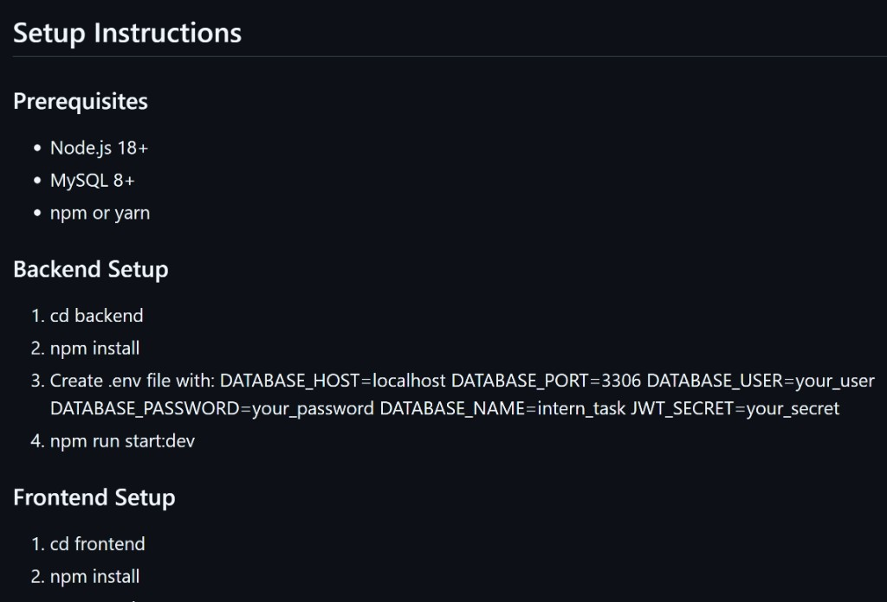

# GadgetHub - SOC44

A full-stack gadget marketplace project with a **PHP frontend (XAMPP)** and **C# ASP.NET Core Web API backend**.  
Users can browse products, place orders, and track order flow while admins/distributors manage products, quotations, and order updates.

## Project Preview

### Home Page


### Featured Products


### Login Page


### Register Page


### Products Page


### Orders Page


### Setup Guide Screenshot


---

## Features

- User registration and login
- Distributor registration and login
- Product and category management (CRUD)
- Order creation and management
- Quotation submission and selection
- Price and order status updates
- Dashboard count endpoints (`users`, `orders`, `distributors`)
- Swagger API documentation for backend

---

## Tech Stack

### Frontend
- PHP
- HTML/CSS/JavaScript
- XAMPP (Apache)

### Backend
- C#
- ASP.NET Core Web API (.NET 8)
- Entity Framework Core
- SQL Server
- Swagger (Swashbuckle)

---

## Project Structure

```text
Frontend (PHP):
C:\xampp\htdocs\SOC44_Front_Ransara_GadgetHub_New

Backend (C#):
C:\Users\user\source\repos\GagetHub_SOC44_15_New
